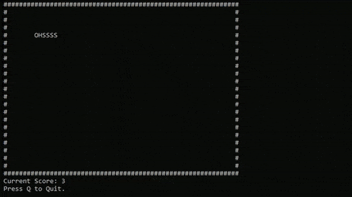

# HiraASCII

This is an open-source ASCII engine with an easy to use gameplay framework, and very basic adaptations of vertex and fragment shaders.

# How to Use

Download the source files and check out the HiraSnake project. It contains an example project snake game implementation.

# Made by Rohan Jadav
## Thanks